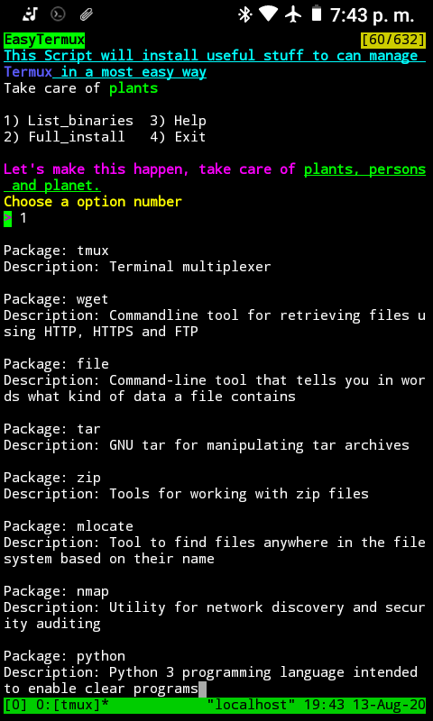

# EasyTermux

### :warning: This script only works in *Termux*, don't work in any GnuLinux distro(Maybe in freeBSD because it use a binary named pkg...lol is joke, not tested) because it use the pkg binary instead of apt for install the binaries :warning:

---

This Script install and configure useful binaries and tools in Termux.

> Binaries for install:


Package: tmux

Description: Terminal multiplexer

Package: wget

Description: Commandline tool for retrieving files using HTTP, HTTPS and FTP

Package: file

Description: Command-line tool that tells you in words what kind of data a file contains

Package: tar

Description: GNU tar for manipulating tar archives

Package: zip

Description: Tools for working with zip files

Package: mlocate

Description: Tool to find files anywhere in the filesystem based on their name

Package: nmap

Description: Utility for network discovery and security auditing

Package: python

Description: Python 3 programming language intended to enable clear programs

Package: golang

Description: Go programming language compiler

Package: man

Description: Man page viewer from the mandoc toolset

Package: littlecms

Description: Color management library

Package: git

Description: Fast, scalable, distributed revision control system

Package: binutils

Description: Collection of binary tools, the main ones being ld, the GNU linker, and as, the GNU assembler

Package: proot

Description: Emulate chroot, bind mount and binfmt_misc for non-root users

Package: radare2

Description: Advanced Hexadecimal Editor

Package: dnsutils

Description: This package delivers various client programs related to DNS

Package: nano
Descripton: Small, free and friendly text editor

Package: dropbear
Description: dropbear is a SSH server designed to be small enough to be used in small memory environments, while still being functional and secure enough for general use

Package: cronie
Description: Daemon that runs specified programs at scheduled times and related tools

Package: bash-completion
Description: Programmable completion for the bash shell

Name: pip

Summary: The PyPA recommended tool for installing Python packages.

Name: eg

Summary: Examples at the command line

Name: tldr

Summary: command line client for tldr

Name: ipython

Summary: IPython: Productive Interactive Computing

Name: [ccat](https://github.com/jingweno/ccat)

Description: ccat is the colorizing cat. It works similar to cat but displays content with syntax highlighting.

Name: [LS_COLORS](https://github.com/trapd00r/LS_COLORS)

Description: A collection of LS_COLORS definitions; needs your contribution! 

Name: easydropbear

Description: A script for set in a easy way the dropbear server(For ssh connections) use the argument -h for see the options of config.

---


> How to use:

Only run the Script `termuxScript.sh` and choose any option, example:

```bash
./termuxScript.sh
```



---

:warning:
 ### How to configure dropbear for use dropbear keys with openssh
 
 > The thing is that termux shell don't use passwords logins so the only way for connect to termux with ssh is with RSA keys, here the confusion, dropbear use they own format of private keys, so here the steps for configure well the dropbear ssh server, first the private keys is in this path from your termux home, remember that this is based in the folder structure that use termux:
 
 `../usr/etc/dropbear`
 
 > In this path, you will find the private keys (the keys that need the client ssh of drobear/openssh for connect to the server), this is important, dropbear by default don't make in automatic the folder ssh(folder $HOME/.ssh ) and the file ($HOME/.ssh/authorized_keys) for work well, so the first is create it:
 
`mkdir ~/.ssh`

> Then we print the public key of our private key, and we add to the file authorized_keys, the next command create the file authorized_keys and send the public key to it:

`dropbearkey -y -f ~/../usr/etc/dropbear/dropbear_rsa_host_key | grep "^ssh-rsa " >> ~/ssh/authorized_keys`

> Then we only use the dropbear_rsa_host_key (Just if we're using the dropbear client "dbclient"), if we  gonna use openssh for connect to the dropbear server, we must to convert the private key to openssh format this is do it, with the command dropbearconvert:

`dropbearconvert dropbear openssh ~/../usr/etc/dropbear/dropbear_rsa_host_key $HOME/rsa_dropbearkey_openssh`

> Then of this you only need to change the permission lread and write over the key, the key only must have permission of read and write for the owner(user), if you don't change the permission the client will not use the key, so here the command(from termux another case you must use sudo with this command):

`chmod g-rw,o-r $HOME/rsa_dropbearkey_openssh`

> Then you only need share private key to the device with you gonna connect to the ssh server of dropbear, you can share it from termux running a http server in the path where is the private key, in this case is the home of termux(use the command "ifconfig" or "ip address" for know the ip of your device), so the command is this:

`cd; python -m http.server 8080`

> Then just connect to the ip address of your device that is running the dropbear server from your web browser putting in the url bar the ip and the port 192.168.0.10:8080 and just select the key and click in it, the key will be downloaded and you can use for connect


> And for last for use the private key just use the argument -i in your ssh command for specific which key use it(This from client openssh):

`ssh -i rsa_dropbearkey_openssh 192.168.0.10`


And this is all, so relax, smile, never give up, Peace && Love

:warning:

Animus, smile and be ecologic, take care of plants, persons and animals, take care of our planet, use GnuLinux, don't smoke crack😉, and if any time you see a porn video of me in a porn web site, give it a like please...lol...smile, save the planet, don't over warm with cryptocurrencies please, is our planet, we must to care it, is the planet of our sons and daughters, parents, brothers, relatives and friends, do it for they.
